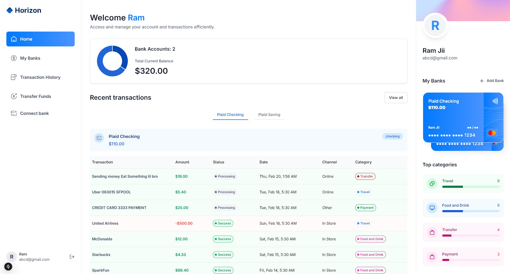
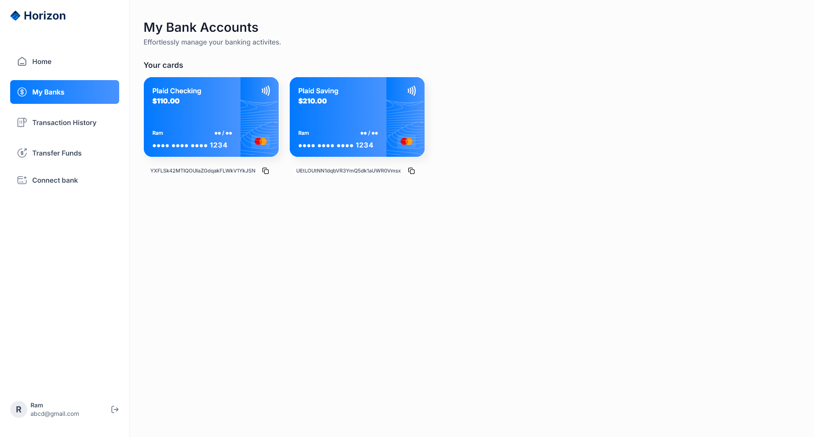
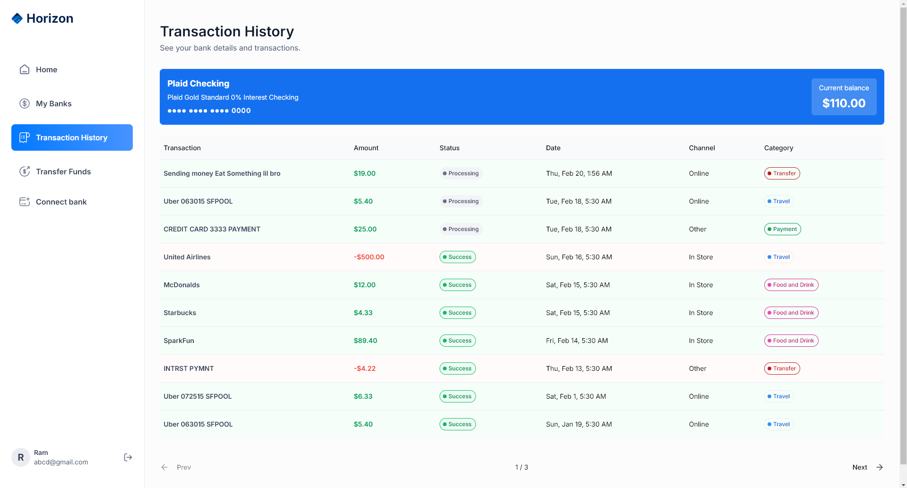
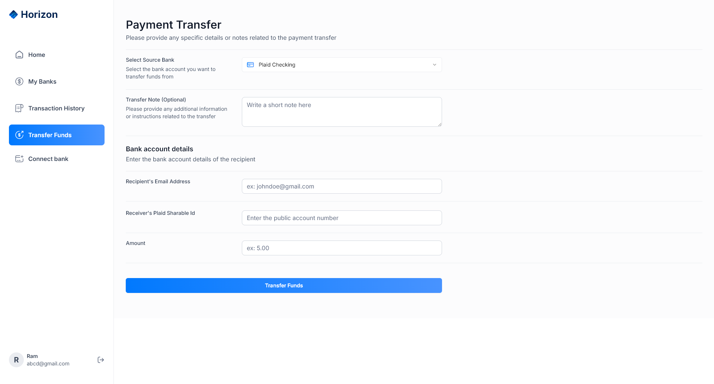

# Horizon

Welcome to **Horizon**, a modern web application built with Next.js, TypeScript, and Tailwind CSS. Designed for performance and scalability, Horizon is a platform where users can connect their banks and do transactions on real time, access their recent transactions and much more.

## Live Demo

🚀 **[Check out Horizon live](https://horizon-plum-nu.vercel.app/)**

## Screenshots

Here are some previews of Horizon in action:






## Features

- **Next.js**
- **TypeScript**
- **React**
- **Tailwind CSS**
- **Appwrite**
- **Plaid**
- **Dwolla**
- **Sentry**
- **React Hook Form**
- **Zod**
- **ShadCN**
- **Chart.js**


## <a name="features">🔋 Features</a>

👉 **Authentication**: An ultra-secure SSR authentication with proper validations and authorization

👉 **Connect Banks**: Integrates with Plaid for multiple bank account linking

👉 **Home Page**: Shows general overview of user account with total balance from all connected banks, recent transactions, money spent on different categories, etc

👉 **My Banks**: Check the complete list of all connected banks with respective balances, account details

👉 **Transaction History**: Includes pagination and filtering options for viewing transaction history of different banks

👉 **Real-time Updates**: Reflects changes across all relevant pages upon connecting new bank accounts.

👉 **Funds Transfer**: Allows users to transfer funds using Dwolla to other accounts with required fields and recipient bank ID.

👉 **Responsiveness**: Ensures the application adapts seamlessly to various screen sizes and devices, providing a consistent user experience across desktop, tablet, and mobile platforms.

and many more, including code architecture and reusability. 

## <a name="quick-start">🤸 Quick Start</a>

Follow these steps to set up the project locally on your machine.

**Prerequisites**

Make sure you have the following installed on your machine:

- [Git](https://git-scm.com/)
- [Node.js](https://nodejs.org/en)
- [npm](https://www.npmjs.com/) (Node Package Manager)

**Cloning the Repository**

```bash
git clone https://github.com/adrianhajdin/banking.git
cd banking
```

**Installation**

Install the project dependencies using npm:

```bash
npm install
```

**Set Up Environment Variables**

Create a new file named `.env` in the root of your project and add the following content:

```env
#NEXT
NEXT_PUBLIC_SITE_URL=

#APPWRITE
NEXT_PUBLIC_APPWRITE_ENDPOINT=https://cloud.appwrite.io/v1
NEXT_PUBLIC_APPWRITE_PROJECT=
APPWRITE_DATABASE_ID=
APPWRITE_USER_COLLECTION_ID=
APPWRITE_BANK_COLLECTION_ID=
APPWRITE_TRANSACTION_COLLECTION_ID=
APPWRITE_SECRET=

#PLAID
PLAID_CLIENT_ID=
PLAID_SECRET=
PLAID_ENV=
PLAID_PRODUCTS=
PLAID_COUNTRY_CODES=

#DWOLLA
DWOLLA_KEY=
DWOLLA_SECRET=
DWOLLA_BASE_URL=https://api-sandbox.dwolla.com
DWOLLA_ENV=sandbox

```

Replace the placeholder values with your actual respective account credentials. You can obtain these credentials by signing up on the [Appwrite](https://appwrite.io/?utm_source=youtube&utm_content=reactnative&ref=JSmastery), [Plaid](https://plaid.com/) and [Dwolla](https://www.dwolla.com/)

**Running the Project**

```bash
npm run dev
```

Open [http://localhost:3000](http://localhost:3000) in your browser to view the project.
